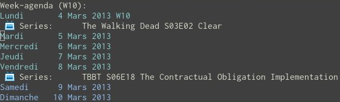

# TVRage2Org

TVRage2Org is a ruby script that automatically fetches your favourite
shows on [TVRage](http://www.tvrage.com) and make it into an
[Org](http://orgmode.org) file to be part of your agenda files. You
have something like that:

